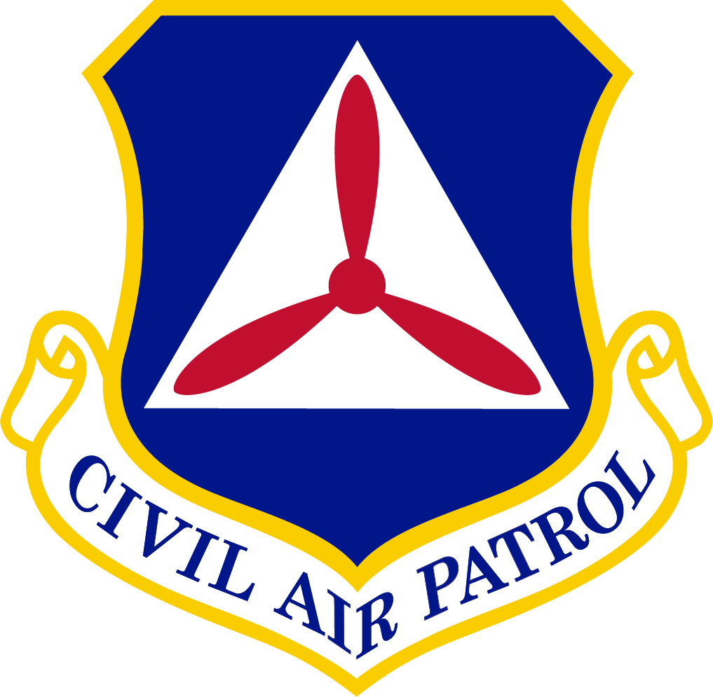

*********************************
CAP NASA Aviation Weather Mission
*********************************

.. |date| date:: 2024-03-01/2024-07-31

<name>, <rank>, CAP
xxWG Director of Operations
Civil Air Patrol

<name>, <rank>, USAF
CAP-USAF Det x/CC
Civil Air Patrol — United States Air Force

Table of Contents
=================

1. `General`_
2. `Application`_
3. `Flight Operations`_
4. `Administration`_
5. `Communications`_
6. `Cadet Participation`_
7. `Safety`_
8. `Staff Requirements`_
9. `Uniform Requirements`_
10. `Facilities`_
11. `Logistics`_
12. `Military Support Requirements`_
13. `Public Affairs`_
14. `Contingencies and Emergency Services Missions`_

Appendix
--------

A. `Data Format`_

.. include:: opsplan/general.rst

.. include:: opsplan/application.rst

.. include:: opsplan/flightops.rst

.. include:: opsplan/admin.rst

.. include:: opsplan/comms.rst

.. include:: opsplan/cadets.rst

.. include:: opsplan/safety.rst

.. include:: opsplan/staffreq.rst

.. include:: opsplan/uniforms.rst

.. include:: opsplan/facilities.rst

.. include:: opsplan/logistics.rst

.. include:: opsplan/dodsupport.rst

.. include:: opsplan/pio.rst

.. include:: opsplan/contingencies.rst

.. Appendicies

.. include:: appendix/dataformat.rst
